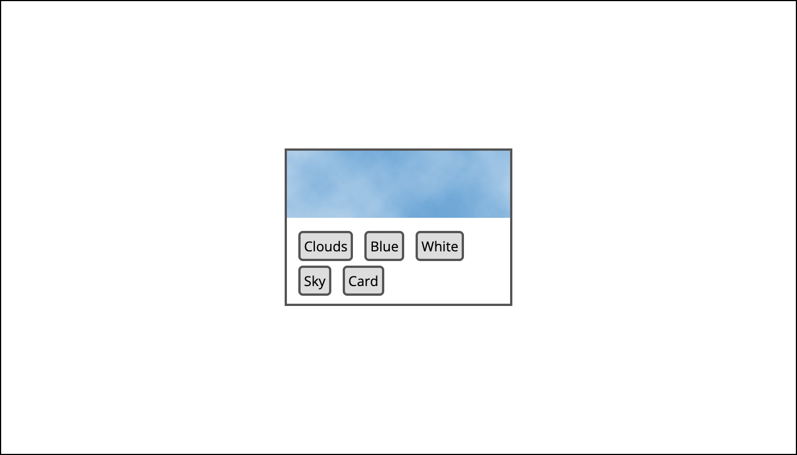

# Assignment2


This repository contains the code and assets for Lab 2 of the ITMD 4/541 course. In this lab, we have explored various CSS techniques to create different layouts and styles.

## Description

The lab is divided into several sections, each focusing on different aspects of CSS layout and styling. 

overview of what each section covers:
### Flexbox Part 1

In this section, we create a horizontal navigation bar using CSS Flexbox. The navigation buttons are evenly spaced, and the goal is to match the provided example image.


### Flexbox Part 2

This section demonstrates how to use CSS Flexbox to turn an unordered list into three equal-width columns and reorder them using CSS Flexbox properties. The columns should be reordered without modifying the HTML structure.


### Flexbox Part 3

Here, we center a card both horizontally and vertically within a box. Additionally, we style a list of words to resemble tags. The goal is to match the provided example image.



### Grid Part 1

In this section, we create a grid where six child boxes auto-place themselves. The grid consists of four evenly spaced columns with a 20-pixel gap between columns and rows.


### Grid Part 2

This section focuses on positioning two boxes within a 3x3 grid. The blue box should overlap the red box as shown in the example image.


### Grid Part 3

In Grid Part 3, we transform four grey boxes into a grid that resembles a typical web page layout. The grid has two columns and three rows with specified row heights and column widths.


### Transition Part

The Transition Part of the lab involves adding transition effects to a link when hovering. The background color and text color should smoothly transition with specific durations.

## Usage

- Clone this repository to your local machine:

```bash
git clone https://github.com/VarshithaCS0607/Assignment2.git
